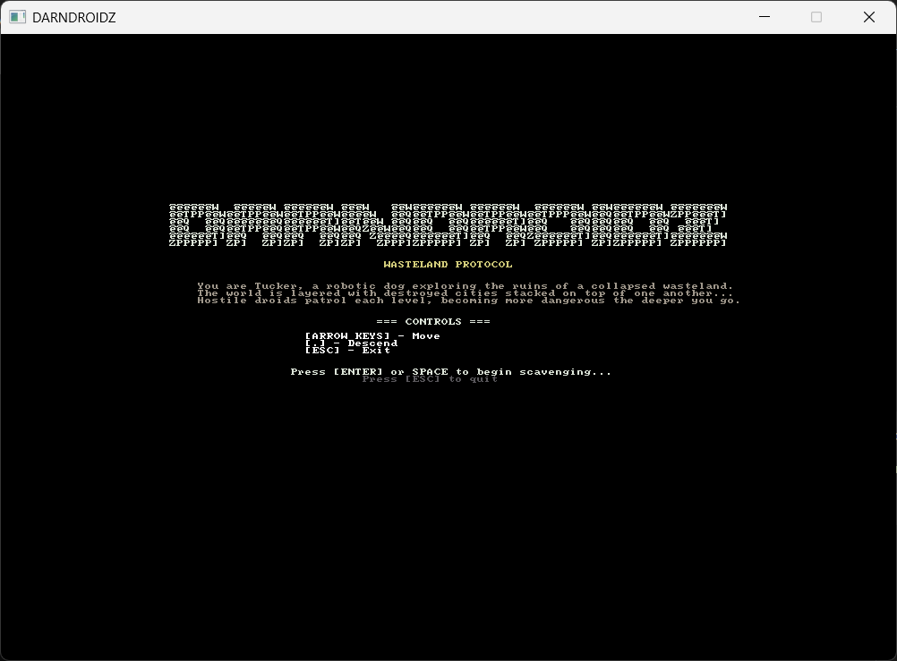
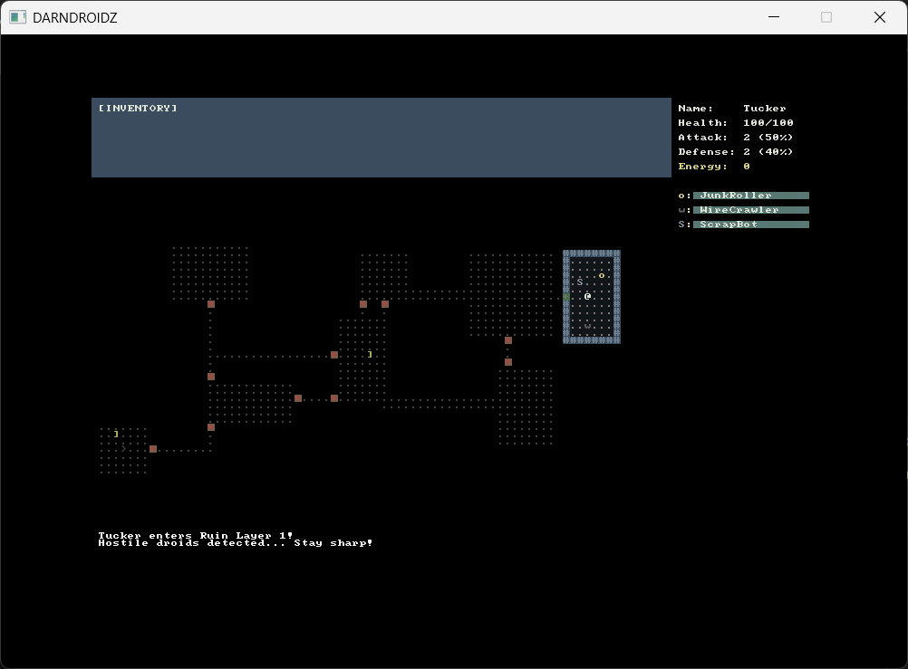

# DarnDroidz

DarnDroidz is a turn-based roguelike game built in C# using RogueSharp V3 and RLNET, based on the RogueSharp V3 Tutorial by Faron Bracy.


## Screenshots





## How to Run

### From Release (Executable)
Download the latest release from Releases and extract all files to a folder.
Keep all files together in the same folder, as the .exe will not run without them.
Double-click DarnDroidz.exe to play.


### From Source
```bash
git clone https://github.com/mechagr/darndroidz.git
```
Open the solution in Visual Studio and run the project. Requires .NET Framework and the included dependencies (RogueSharp V3, RLNET).


## Credits

Based on the [RogueSharp V3 Tutorial by Faron Bracy](https://roguesharp.wordpress.com/).
